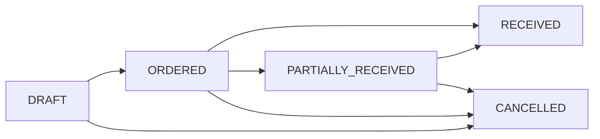
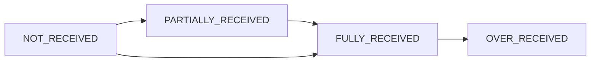
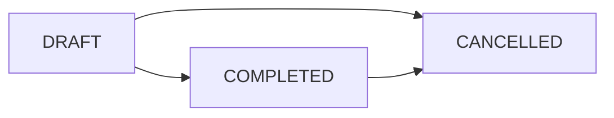

# Purchase Order & Goods Received Note (GRN) Integration
## Technical Specification & Implementation Guide

**Version**: 1.0  
**Date**: 2025-08-04  
**Status**: Draft for Review  

---

## 📋 Table of Contents

1. [Overview](#overview)
2. [Current System Architecture](#current-system-architecture)
3. [Database Schema](#database-schema)
4. [Status Transition Logic](#status-transition-logic)
5. [Business Rules & Workflows](#business-rules--workflows)
6. [API Endpoints](#api-endpoints)
7. [Implementation Requirements](#implementation-requirements)
8. [Edge Cases & Error Handling](#edge-cases--error-handling)
9. [Testing Strategy](#testing-strategy)
10. [Performance Considerations](#performance-considerations)
11. [Implementation Phases](#implementation-phases)
12. [Success Criteria](#success-criteria)
13. [Appendices](#appendices)

---

## 1. Overview

### 1.1 Purpose
This document defines the complete integration logic between Purchase Orders (PO) and Goods Received Notes (GRN) in the Zettaz Cloud POS system, ensuring robust status transitions, inventory management, and data consistency across all scenarios.

### 1.2 Scope
- **PO Creation** → **GRN Creation** (Full/Partial)
- **GRN Editing** (Quantity changes, item additions/removals)
- **GRN Deletion** (Status rollback, inventory reversal)
- **Status Synchronization** between PO, PO Items, and GRN
- **Inventory Management** (Stock levels, WAC calculations)
- **Multi-tenant Data Isolation**

### 1.3 Key Principles
- **Atomic Transactions**: All operations must be transaction-safe
- **Data Consistency**: PO status must always reflect actual received quantities
- **Audit Trail**: Complete history of all status changes
- **Business Validation**: Prevent invalid operations (over-receiving, negative stock)
- **Performance**: Efficient status calculations for large datasets

---

## 2. Current System Architecture

### 2.1 Technology Stack
- **Backend**: Node.js + Express.js v4.18.2
- **Database**: MySQL2 v3.14.3 (Raw SQL, no ORM)
- **Authentication**: JWT-based with tenant isolation
- **Architecture**: MVC pattern (Routes → Controllers → Services → Database)
- **Transactions**: Manual transaction handling with connection pooling

### 2.2 Core Components
```
┌─────────────────┐    ┌─────────────────┐    ┌─────────────────┐
│   PO Routes     │    │  GRN Controller │    │  Inventory Mgmt │
│                 │    │                 │    │                 │
│ - Create PO     │────│ - Create GRN    │────│ - Stock Updates │
│ - Update PO     │    │ - Edit GRN      │    │ - WAC Calc      │
│ - Delete PO     │    │ - Delete GRN    │    │ - Audit Logs    │
│ - Status Mgmt   │    │ - Status Change │    │                 │
└─────────────────┘    └─────────────────┘    └─────────────────┘
```

---

## 3. Database Schema

### 3.1 Core Tables

#### Purchase Orders
```sql
purchase_orders (
  id CHAR(36) PRIMARY KEY,
  tenant_id CHAR(36) NOT NULL,
  store_id CHAR(36),
  supplier_id CHAR(36),
  purchase_order_number VARCHAR(50),
  status ENUM('DRAFT', 'ORDERED', 'PARTIALLY_RECEIVED', 'RECEIVED', 'CANCELLED'),
  order_date DATE,
  expected_delivery_date DATE,
  total_amount DECIMAL(12,2),
  created_by_user_id CHAR(36),
  created_at TIMESTAMP,
  updated_at TIMESTAMP
)
```

#### Purchase Order Items
```sql
purchase_order_items (
  id CHAR(36) PRIMARY KEY,
  purchase_order_id CHAR(36) NOT NULL,
  product_id CHAR(36) NOT NULL,
  quantity_ordered DECIMAL(10,2) NOT NULL,
  quantity_received DECIMAL(10,2) DEFAULT 0.00,
  cost_price DECIMAL(10,2) NOT NULL,
  status VARCHAR(50) DEFAULT NULL,
  item_received_status ENUM('NOT_RECEIVED', 'PARTIALLY_RECEIVED', 'FULLY_RECEIVED', 'OVER_RECEIVED'),
  line_total DECIMAL(12,2) GENERATED ALWAYS AS (quantity_ordered * cost_price) STORED,
  created_at TIMESTAMP,
  updated_at TIMESTAMP
)
```

#### Goods Received Notes
```sql
goods_received_notes (
  id CHAR(36) PRIMARY KEY,
  tenant_id CHAR(36) NOT NULL,
  store_id CHAR(36),
  grn_number VARCHAR(50) UNIQUE,
  supplier_id CHAR(36),
  purchase_order_id CHAR(36),
  status ENUM('DRAFT', 'COMPLETED', 'CANCELLED'),
  received_date DATE,
  total_received_value DECIMAL(12,2),
  notes TEXT,
  supplier_invoice_number VARCHAR(100),
  supplier_invoice_date DATE,
  received_by_user_id CHAR(36),
  created_at TIMESTAMP,
  updated_at TIMESTAMP
)
```

#### GRN Items
```sql
grn_items (
  id CHAR(36) PRIMARY KEY,
  grn_id CHAR(36) NOT NULL,
  product_id CHAR(36) NOT NULL,
  purchase_order_item_id CHAR(36),
  quantity_received DECIMAL(10,2) NOT NULL,
  unit_cost_price DECIMAL(10,2) NOT NULL,
  line_total DECIMAL(12,2) GENERATED ALWAYS AS (quantity_received * unit_cost_price) STORED,
  created_at TIMESTAMP,
  updated_at TIMESTAMP
)
```

### 3.2 Key Relationships
- **PO → PO Items**: One-to-Many
- **GRN → GRN Items**: One-to-Many  
- **PO Item → GRN Items**: One-to-Many (multiple GRNs can receive from same PO item)
- **Product → Inventory**: Direct stock/WAC updates

---

## 4. Status Transition Logic

### 4.1 Purchase Order Status Flow



#### Status Calculation Rules
```javascript
// PO Status Logic
if (allItemsFullyReceived && hasOrderableItems) {
    newStatus = 'RECEIVED';
} else if (anyItemReceived) {
    newStatus = 'PARTIALLY_RECEIVED';
} else if (hasOrderableItems) {
    newStatus = 'ORDERED';
} else {
    newStatus = 'DRAFT'; // No items or all cancelled
}
```

### 4.2 PO Item Status Flow



#### Item Status Calculation
```javascript
// PO Item Status Logic
const receivedQty = parseFloat(item.quantity_received || 0);
const orderedQty = parseFloat(item.quantity_ordered || 0);

if (receivedQty === 0) {
    itemStatus = 'NOT_RECEIVED';
} else if (receivedQty >= orderedQty) {
    itemStatus = receivedQty > orderedQty ? 'OVER_RECEIVED' : 'FULLY_RECEIVED';
} else {
    itemStatus = 'PARTIALLY_RECEIVED';
}
```

### 4.3 GRN Status Flow



#### GRN Status Rules
- **DRAFT**: Editable, no inventory impact, can be modified/deleted freely
- **COMPLETED**: Locked for editing, inventory committed, can only be cancelled with full reversal
- **CANCELLED**: Reversed, inventory rolled back, final status

**Simplified Transition Logic**:
- DRAFT → COMPLETED: Commits inventory changes and locks GRN from editing
- DRAFT/COMPLETED → CANCELLED: Reverses all changes and marks as cancelled
- No approval workflows or complex status chains needed

---

## 5. Business Rules & Workflows

### 5.1 Simplified Business Rules

#### Core Principles
1. **No Over-Receiving**: Strict validation - cannot receive more than ordered quantity
2. **Simple Status Flow**: Only DRAFT and COMPLETED statuses for active GRNs
3. **Data Accuracy**: All PO statuses must perfectly reflect actual received quantities
4. **User-Friendly**: Clear error messages and smooth workflow transitions
5. **Bug-Free Operation**: Every operation must be transaction-safe and reliable

#### Validation Rules
```javascript
const businessRules = {
  grn: {
    allowOverReceiving: false,           // Strict - no tolerance
    maxOverReceivePercent: 0,            // Zero tolerance
    requireApprovalForOverReceive: false, // No approval workflow
    autoCompleteOnFullReceipt: false     // Manual completion only
  },
  po: {
    autoStatusUpdate: true,              // Auto-update based on received quantities
    preventEditAfterReceipt: true,       // Lock PO after any receipt
    requireReasonForCancellation: false  // Simple cancellation
  },
  inventory: {
    allowNegativeStock: false,           // Prevent negative stock
    wacCalculationPrecision: 4,          // 4 decimal places for WAC
    strictValidation: true               // All operations must pass validation
  }
};
```

### 5.2 GRN Creation Scenarios

#### Scenario A: Full PO Receipt
```
Input: PO with 3 items, GRN receives all items completely
Process:
1. Create GRN in DRAFT status with all PO items
2. Validate: received quantities ≤ ordered quantities (strict)
3. Update PO item quantities to match received quantities
4. Set PO item statuses to 'FULLY_RECEIVED'
5. Set PO status to 'RECEIVED'
6. When user marks GRN as COMPLETED: Update inventory (stock + WAC)

Expected Result:
- PO Status: RECEIVED
- All PO Items: FULLY_RECEIVED
- GRN Status: COMPLETED
- Inventory: Updated with received quantities
```

#### Scenario B: Partial PO Receipt
```
Input: PO with 3 items, GRN receives 2 items partially, 1 item fully
Process:
1. Create GRN in DRAFT status with received quantities
2. Validate: each item's received quantity ≤ remaining orderable quantity
3. Update PO item quantities incrementally
4. Set mixed PO item statuses (PARTIALLY_RECEIVED/FULLY_RECEIVED)
5. Set PO status to 'PARTIALLY_RECEIVED'
6. When user marks GRN as COMPLETED: Update inventory for received items

Expected Result:
- PO Status: PARTIALLY_RECEIVED
- PO Items: Mixed statuses based on actual received quantities
- GRN Status: COMPLETED
- Inventory: Updated only for received items
```

### 5.3 GRN Edit Scenarios

#### Scenario C: DRAFT GRN Quantity Changes
```
Input: DRAFT GRN, user changes received quantity for item
Process:
1. Validate: GRN is in DRAFT status (only DRAFT can be edited)
2. Calculate new quantity and validate ≤ (ordered - already_received_from_other_grns)
3. Update GRN item quantity
4. Recalculate PO item received quantity
5. Update PO item status based on new total
6. Recalculate PO status
7. No inventory changes until GRN is marked COMPLETED

Business Rules:
- Only DRAFT GRNs can be edited
- Cannot exceed remaining orderable quantity (strict validation)
- Real-time validation with clear error messages
- Changes are immediate but inventory impact waits for COMPLETED status
```

#### Scenario D: DRAFT GRN Item Addition/Removal
```
Input: DRAFT GRN, user adds/removes items
Process:
1. Validate: GRN is in DRAFT status
2. For additions: Validate item belongs to same PO and has available quantity
3. For removals: Remove item and recalculate totals
4. Recalculate affected PO item quantities and statuses
5. Recalculate PO status
6. Update GRN total value

Business Rules:
- Only DRAFT GRNs allow item changes
- New items must have available quantity > 0
- Removing items cannot create data inconsistencies
- All changes validated in real-time
```

### 5.4 GRN Deletion Scenarios

#### Scenario E: DRAFT GRN Deletion
```
Input: Delete DRAFT GRN
Process:
1. Validate: GRN is in DRAFT status
2. Delete GRN items
3. Delete GRN header
4. No PO status changes needed (DRAFT has no impact on PO status)
5. No inventory changes needed

Expected Result:
- GRN: Deleted completely
- PO Status: Unchanged (DRAFT had no impact)
- PO Items: Unchanged
- Inventory: Unchanged
```

#### Scenario F: COMPLETED GRN Deletion (Cancellation)
```
Input: Delete/Cancel COMPLETED GRN
Process:
1. Validate: GRN is in COMPLETED status
2. Mark GRN as CANCELLED (don't actually delete - keep audit trail)
3. Reverse inventory changes (reduce stock, recalculate WAC)
4. Reduce PO item received quantities
5. Recalculate PO item statuses
6. Recalculate PO status (may change from RECEIVED to PARTIALLY_RECEIVED)
7. Create inventory reversal audit logs

Expected Result:
- GRN: Status changed to CANCELLED (preserved for audit)
- PO Status: Recalculated based on remaining received quantities
- PO Items: Statuses recalculated
- Inventory: Reversed to pre-GRN state
- Audit Trail: Complete record of reversal
```

---

## 6. API Endpoints

### 6.1 Simplified Core Endpoints

#### PO Management
```
GET    /api/purchase-orders              # List POs with current status
GET    /api/purchase-orders/:id          # Get PO with items and accurate status
POST   /api/purchase-orders              # Create PO
PUT    /api/purchase-orders/:id          # Update PO (if no receipts exist)
DELETE /api/purchase-orders/:id          # Delete/Cancel PO
```

#### GRN Management
```
GET    /api/grn                          # List GRNs with filters
GET    /api/grn/:id                      # Get GRN with items
POST   /api/grn                          # Create GRN (always starts as DRAFT)
PUT    /api/grn/:id                      # Update GRN (DRAFT only)
DELETE /api/grn/:id                      # Delete DRAFT or Cancel COMPLETED
PATCH  /api/grn/:id/complete             # Mark GRN as COMPLETED (commits inventory)
```

#### Integration Endpoints
```
GET    /api/purchase-orders/:id/available-items    # Items available for receiving
GET    /api/purchase-orders/:id/grns               # All GRNs for specific PO
POST   /api/grn/from-po/:po_id                     # Create GRN from PO template
```

### 6.2 Error Response Format (User-Friendly)
```json
{
  "success": false,
  "error": {
    "code": "QUANTITY_EXCEEDED",
    "message": "Cannot receive 15 units of Product ABC. Only 8 units remaining.",
    "details": {
      "product_name": "Product ABC",
      "ordered_quantity": 20,
      "already_received": 12,
      "attempted_quantity": 15,
      "max_available": 8
    },
    "userAction": "Please reduce the quantity to 8 or less and try again."
  }
}
```

---

## 7. Implementation Requirements

### 7.1 Phase-Based Implementation Plan

#### Phase 1: Foundation & Bug Fixes (Week 1)
**Goal**: Fix all current issues and establish solid foundation

**Tasks**:
- [ ] Fix MySQL2 result handling in all PO/GRN routes
- [ ] Implement robust transaction handling with proper rollback
- [ ] Fix PO status calculation logic (handle all edge cases)
- [ ] Add comprehensive input validation
- [ ] Create unit tests for core status calculation functions
- [ ] Test and validate current PO creation/editing workflow

**Success Criteria**:
- All existing PO operations work without errors
- PO statuses accurately reflect current state
- No MySQL2 result handling bugs
- All operations are transaction-safe

#### Phase 2: GRN Core Functionality (Week 2)
**Goal**: Implement complete GRN creation and basic editing

**Tasks**:
- [ ] Implement GRN creation from PO (with strict validation)
- [ ] Add GRN item quantity editing (DRAFT only)
- [ ] Implement GRN completion (DRAFT → COMPLETED with inventory updates)
- [ ] Add GRN deletion (DRAFT) and cancellation (COMPLETED)
- [ ] Ensure PO status updates correctly with all GRN operations
- [ ] Add comprehensive error handling with user-friendly messages

**Success Criteria**:
- Can create GRN from any PO with proper validation
- Can edit DRAFT GRNs without data corruption
- PO statuses update correctly after all GRN operations
- Inventory updates correctly when GRN is completed
- All error scenarios handled gracefully

#### Phase 3: Advanced Features & Polish (Week 3)
**Goal**: Complete all edge cases and enhance user experience

**Tasks**:
- [ ] Implement GRN item addition/removal for DRAFT GRNs
- [ ] Add support for multiple GRNs per PO
- [ ] Implement complete COMPLETED GRN cancellation with inventory reversal
- [ ] Add audit logging for all status changes
- [ ] Optimize performance for large datasets
- [ ] Add comprehensive integration tests

**Success Criteria**:
- All GRN scenarios work flawlessly
- Multiple GRNs per PO handled correctly
- Complete audit trail for all operations
- Performance acceptable for production use
- All integration tests pass

#### Phase 4: Testing & Production Readiness (Week 4)
**Goal**: Ensure production-ready quality

**Tasks**:
- [ ] Complete end-to-end testing of all workflows
- [ ] Performance testing and optimization
- [ ] Security review and hardening
- [ ] Frontend integration and UI testing
- [ ] Documentation completion and review
- [ ] Deployment preparation

**Success Criteria**:
- 100% test coverage for critical paths
- All performance benchmarks met
- Security vulnerabilities addressed
- Frontend integration complete and tested
- Ready for production deployment

### 7.2 Critical Functions to Implement

#### A. Enhanced PO Status Calculation (Phase 1)
```javascript
const updatePurchaseOrderStatus = async (purchaseOrderId, connection, tenant_id) => {
  // 1. Get all PO items with current received quantities
  // 2. Calculate aggregate status: DRAFT/ORDERED/PARTIALLY_RECEIVED/RECEIVED
  // 3. Handle edge cases: no items, all cancelled, mixed statuses
  // 4. Update PO status atomically with proper locking
  // 5. Log status change for audit trail
  // 6. Validate data consistency
}
```

#### B. GRN Creation with Validation (Phase 2)
```javascript
const createGrnFromPO = async (poId, grnData, connection, tenant_id) => {
  // 1. Validate PO exists and is in correct status
  // 2. Validate all items have available quantities
  // 3. Strict validation: received ≤ available (no over-receiving)
  // 4. Create GRN in DRAFT status
  // 5. Update PO item quantities and statuses
  // 6. Recalculate PO status
  // 7. Return success with updated statuses
}
```

#### C. GRN Completion with Inventory Updates (Phase 2)
```javascript
const completeGrn = async (grnId, connection, tenant_id) => {
  // 1. Validate GRN is in DRAFT status
  // 2. Get all GRN items
  // 3. Update inventory: stock quantities and WAC calculations
  // 4. Mark GRN as COMPLETED
  // 5. Create inventory audit logs
  // 6. Ensure all changes are atomic
}
```

#### D. GRN Cancellation with Reversal (Phase 3)
```javascript
const cancelCompletedGrn = async (grnId, connection, tenant_id) => {
  // 1. Validate GRN is in COMPLETED status
  // 2. Reverse inventory changes (stock and WAC)
  // 3. Reduce PO item received quantities
  // 4. Recalculate PO and PO item statuses
  // 5. Mark GRN as CANCELLED
  // 6. Create complete audit trail
  // 7. Validate no negative stock results
}
```

---

## 8. Success Criteria & Quality Gates

### 8.1 Functional Requirements
- ✅ **Data Accuracy**: PO statuses always match actual received quantities
- ✅ **No Over-Receiving**: Strict validation prevents receiving more than ordered
- ✅ **Transaction Safety**: All operations atomic with complete rollback on failure
- ✅ **User Experience**: Clear error messages and smooth workflow transitions
- ✅ **Inventory Accuracy**: Stock levels and WAC calculations always correct

### 8.2 Technical Requirements
- ✅ **Bug-Free Operation**: Zero critical bugs in production
- ✅ **Performance**: All operations complete within 2 seconds
- ✅ **Data Consistency**: No orphaned records or inconsistent states
- ✅ **Error Handling**: All edge cases handled with appropriate user feedback
- ✅ **Audit Trail**: Complete logging of all status changes and operations

### 8.3 Quality Gates for Each Phase
**Phase 1**: All existing functionality works without errors
**Phase 2**: GRN creation and basic editing work flawlessly
**Phase 3**: All advanced scenarios work with proper error handling
**Phase 4**: Production-ready with complete testing and documentation

---

**Document Status**: Updated Based on User Feedback  
**Implementation Approach**: Simplified, focused on reliability and user experience  
**Next Steps**: Begin Phase 1 implementation with foundation fixes
