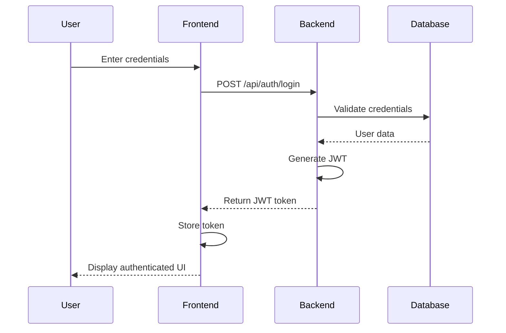

# Authentication and Authorization

This section covers the authentication and authorization system used in Zettaz Cloud Enterprise, explaining how users are authenticated, how permissions are managed, and how to implement security best practices.

## Overview

Zettaz Cloud Enterprise implements a robust authentication and authorization system based on JSON Web Tokens (JWT) and role-based access control (RBAC). This system ensures that:

1. Users can securely authenticate to the application
2. User sessions are managed efficiently
3. Access to resources is controlled based on user roles and permissions
4. Multi-tenancy is enforced at all levels

## Authentication Flow

### Login Process

1. User submits credentials (email/username and password) to `/api/auth/login`
2. Backend validates credentials against the database
3. If valid, a JWT token is generated and returned to the client
4. Client stores the token (typically in localStorage or secure cookie)
5. Token is included in subsequent API requests



### Token Structure

The JWT token contains the following claims:

```json
{
  "sub": "user-uuid",
  "email": "user@example.com",
  "name": "John Doe",
  "tenant_id": "tenant-uuid",
  "role": "admin",
  "permissions": ["read:users", "write:users", "read:products"],
  "iat": 1622825602,
  "exp": 1622911602
}
```

### Token Validation

For each protected API request:

1. The client includes the JWT token in the Authorization header
2. The backend extracts and verifies the token signature
3. The backend checks if the token is expired
4. The backend validates that the user has the required permissions
5. If multi-tenant, the backend verifies the tenant_id matches the requested resource

## Role-Based Access Control (RBAC)

### User Roles

The system defines the following user roles:

| Role | Description |
|------|-------------|
| `super_admin` | System-wide administrator with access to all tenants |
| `admin` | Tenant administrator with full access to their tenant |
| `manager` | Store manager with access to operational functions |
| `cashier` | POS operator with limited access to sales functions |
| `inventory` | Inventory specialist with access to inventory functions |
| `readonly` | User with read-only access to reports and data |

### Permissions

Permissions follow a resource:action pattern, for example:

- `read:products` - Ability to view products
- `write:products` - Ability to create and update products
- `delete:products` - Ability to delete products
- `read:reports` - Ability to view reports
- `manage:users` - Ability to manage users

### Role-Permission Mapping

Each role is assigned a set of permissions:

| Role | Permissions |
|------|-------------|
| `super_admin` | All permissions across all tenants |
| `admin` | All permissions within their tenant |
| `manager` | Most operational permissions (no user management) |
| `cashier` | Sales-related permissions only |
| `inventory` | Inventory-related permissions only |
| `readonly` | Read-only permissions only |

### Permission Check Implementation

The backend implements permission checks using middleware:

```javascript
// authMiddleware.js
const checkPermission = (requiredPermission) => {
  return (req, res, next) => {
    // Token has already been verified and user attached to req by previous middleware
    const { user } = req;
    
    if (!user) {
      return res.status(401).json({ error: 'Unauthorized' });
    }
    
    // Super admins have all permissions
    if (user.role === 'super_admin') {
      return next();
    }
    
    // Check if user has the required permission
    if (!user.permissions.includes(requiredPermission)) {
      return res.status(403).json({ error: 'Forbidden' });
    }
    
    next();
  };
};

module.exports = { checkPermission };
```

Example usage in routes:

```javascript
// productRoutes.js
const express = require('express');
const router = express.Router();
const { authenticate } = require('../middleware/authMiddleware');
const { checkPermission } = require('../middleware/permissionMiddleware');
const productController = require('../controllers/productController');

router.get('/', authenticate, checkPermission('read:products'), productController.getAllProducts);
router.post('/', authenticate, checkPermission('write:products'), productController.createProduct);
router.put('/:id', authenticate, checkPermission('write:products'), productController.updateProduct);
router.delete('/:id', authenticate, checkPermission('delete:products'), productController.deleteProduct);

module.exports = router;
```

## Multi-tenancy

The authentication system enforces multi-tenancy through the following mechanisms:

1. JWT tokens include the user's `tenant_id`
2. All database queries include a tenant filter
3. API endpoints validate that the requested resource belongs to the user's tenant
4. Frontend components filter and display only the user's tenant data

### Tenant Isolation Middleware

```javascript
// tenantMiddleware.js
const ensureTenantAccess = () => {
  return (req, res, next) => {
    const { user, params } = req;
    
    // Skip for super_admin
    if (user.role === 'super_admin') {
      return next();
    }
    
    // Check resource tenant_id if available
    if (req.resourceTenantId && req.resourceTenantId !== user.tenant_id) {
      return res.status(403).json({ error: 'Forbidden: Resource belongs to a different tenant' });
    }
    
    next();
  };
};

module.exports = { ensureTenantAccess };
```

## Password Security

### Password Requirements

Passwords must meet the following requirements:

- Minimum length: 8 characters
- Must contain at least one uppercase letter
- Must contain at least one lowercase letter
- Must contain at least one number
- Must contain at least one special character

### Password Storage

Passwords are never stored in plain text. The system uses:

1. Bcrypt hashing algorithm with a work factor of 10
2. Unique salt for each password
3. Multiple hash iterations for enhanced security

```javascript
// userController.js (excerpt)
const bcrypt = require('bcrypt');
const saltRounds = 10;

const createUser = async (req, res) => {
  try {
    const { email, password, name, role } = req.body;
    const tenant_id = req.user.tenant_id;
    
    // Hash the password
    const hashedPassword = await bcrypt.hash(password, saltRounds);
    
    // Create the user with hashed password
    const [result] = await db.query(
      'INSERT INTO users (id, tenant_id, email, password, name, role) VALUES (UUID(), ?, ?, ?, ?, ?)',
      [tenant_id, email, hashedPassword, name, role]
    );
    
    // ... rest of the function
  } catch (error) {
    console.error('Error creating user:', error);
    res.status(500).json({ error: 'Internal server error' });
  }
};
```

## Frontend Authentication Implementation

The frontend implements authentication using a React Context:

```jsx
// AuthContext.tsx
import React, { createContext, useState, useEffect, useContext } from 'react';
import { api } from '../services/api';
import { jwtDecode } from 'jwt-decode';

interface User {
  id: string;
  email: string;
  name: string;
  tenant_id: string;
  role: string;
  permissions: string[];
}

interface AuthContextType {
  isAuthenticated: boolean;
  user: User | null;
  loading: boolean;
  login: (email: string, password: string) => Promise<void>;
  logout: () => void;
  hasPermission: (permission: string) => boolean;
}

const AuthContext = createContext<AuthContextType | undefined>(undefined);

export const AuthProvider: React.FC = ({ children }) => {
  const [user, setUser] = useState<User | null>(null);
  const [loading, setLoading] = useState(true);
  
  useEffect(() => {
    // Check if user is already logged in
    const token = localStorage.getItem('token');
    if (token) {
      try {
        const decoded = jwtDecode(token);
        setUser(decoded as User);
        api.defaults.headers.common['Authorization'] = `Bearer ${token}`;
      } catch (error) {
        console.error('Invalid token:', error);
        localStorage.removeItem('token');
      }
    }
    setLoading(false);
  }, []);
  
  const login = async (email: string, password: string) => {
    try {
      const response = await api.post('/auth/login', { email, password });
      const { token } = response.data;
      
      localStorage.setItem('token', token);
      api.defaults.headers.common['Authorization'] = `Bearer ${token}`;
      
      const decoded = jwtDecode(token);
      setUser(decoded as User);
    } catch (error) {
      console.error('Login failed:', error);
      throw error;
    }
  };
  
  const logout = () => {
    localStorage.removeItem('token');
    delete api.defaults.headers.common['Authorization'];
    setUser(null);
  };
  
  const hasPermission = (permission: string) => {
    if (!user) return false;
    if (user.role === 'super_admin') return true;
    return user.permissions.includes(permission);
  };
  
  return (
    <AuthContext.Provider value={{ isAuthenticated: !!user, user, loading, login, logout, hasPermission }}>
      {children}
    </AuthContext.Provider>
  );
};

export const useAuth = () => {
  const context = useContext(AuthContext);
  if (context === undefined) {
    throw new Error('useAuth must be used within an AuthProvider');
  }
  return context;
};
```

## Secure Routes

The frontend implements secure routes using a wrapper component:

```jsx
// PrivateRoute.tsx
import React from 'react';
import { Route, Redirect, RouteProps } from 'react-router-dom';
import { useAuth } from '../contexts/AuthContext';

interface PrivateRouteProps extends RouteProps {
  requiredPermission?: string;
}

const PrivateRoute: React.FC<PrivateRouteProps> = ({ 
  requiredPermission, 
  ...rest 
}) => {
  const { isAuthenticated, loading, hasPermission } = useAuth();
  
  if (loading) {
    return <div>Loading...</div>;
  }
  
  if (!isAuthenticated) {
    return <Redirect to="/login" />;
  }
  
  if (requiredPermission && !hasPermission(requiredPermission)) {
    return <Redirect to="/unauthorized" />;
  }
  
  return <Route {...rest} />;
};

export default PrivateRoute;
```

## Session Management

### Token Expiration

JWT tokens are configured to expire after 12 hours. After expiration, users must login again.

### Token Refresh Strategy

For better UX, the system implements a token refresh strategy:

1. The original token has a short expiration (1 hour)
2. A refresh token with longer expiration (7 days) is also issued
3. When the original token expires, the client uses the refresh token to get a new token
4. This extends the session without requiring the user to login again

```javascript
// authController.js (excerpt)
const refreshToken = async (req, res) => {
  const { refresh_token } = req.body;
  
  if (!refresh_token) {
    return res.status(400).json({ error: 'Refresh token is required' });
  }
  
  try {
    // Verify the refresh token
    const decoded = jwt.verify(refresh_token, process.env.REFRESH_TOKEN_SECRET);
    
    // Get user from database to ensure it still exists and has the same permissions
    const [rows] = await db.query(
      'SELECT id, email, name, tenant_id, role FROM users WHERE id = ?',
      [decoded.sub]
    );
    
    if (!rows.length) {
      return res.status(404).json({ error: 'User not found' });
    }
    
    const user = rows[0];
    
    // Get user permissions
    const [permissionRows] = await db.query(
      'SELECT permission FROM user_permissions WHERE user_id = ?',
      [user.id]
    );
    
    const permissions = permissionRows.map(row => row.permission);
    
    // Generate a new token
    const token = jwt.sign(
      { 
        sub: user.id,
        email: user.email,
        name: user.name,
        tenant_id: user.tenant_id,
        role: user.role,
        permissions
      },
      process.env.JWT_SECRET,
      { expiresIn: '1h' }
    );
    
    res.json({ token });
  } catch (error) {
    console.error('Error refreshing token:', error);
    res.status(401).json({ error: 'Invalid refresh token' });
  }
};
```

## Security Best Practices

### HTTPS

All API communications must use HTTPS in production environments to prevent man-in-the-middle attacks.

### CSRF Protection

The system implements CSRF protection for form submissions through CSRF tokens.

### XSS Prevention

1. React's built-in XSS protection for the frontend
2. Content-Security-Policy headers on the backend
3. Input sanitization for all user inputs

### Rate Limiting

Login and token refresh endpoints implement rate limiting to prevent brute force attacks:

```javascript
// rateLimitMiddleware.js
const rateLimit = require('express-rate-limit');

const loginLimiter = rateLimit({
  windowMs: 15 * 60 * 1000, // 15 minutes
  max: 5, // 5 requests per windowMs per IP
  message: 'Too many login attempts, please try again later'
});

module.exports = { loginLimiter };
```

## Common Authentication Issues and Troubleshooting

### Token Expired

If users frequently report being logged out, check:
- Token expiration time may be too short
- Client-side clock may be out of sync with server
- Browser may be clearing localStorage

### Cross-Origin Issues

If authentication works locally but fails in production:
- Verify CORS configuration on the server
- Ensure cookies are configured with the correct domain and SameSite attributes

### Permission Issues

If users report access denied to features they should have access to:
- Verify the user's role in the database
- Check that the role has the correct permissions assigned
- Ensure the permission check middleware is correctly implemented

## Future Enhancements

1. **Two-Factor Authentication (2FA)**:
   - SMS-based verification
   - Authenticator app integration

2. **Single Sign-On (SSO)**:
   - Integration with popular identity providers (Google, Microsoft, etc.)
   - SAML and OpenID Connect support

3. **Enhanced Session Management**:
   - Device tracking and management
   - Concurrent session limits
   - Session inactivity timeouts
