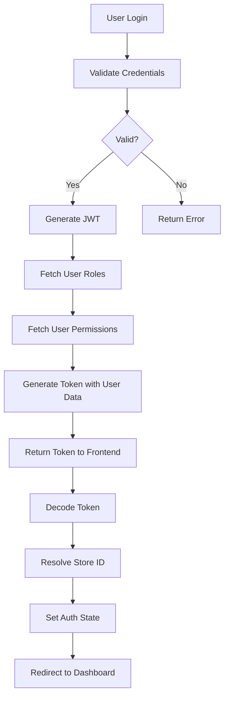

# Role-Based Access Control (RBAC) Implementation

## Overview
This document outlines the RBAC implementation for the Zettaz Cloud application, including role assignment, permission handling, and store ID resolution based on the current database schema and implementation.

## Table of Contents
1. [Database Schema](#database-schema)
2. [Role Hierarchy](#role-hierarchy)
3. [Permission Structure](#permission-structure)
4. [Role Assignment](#role-assignment)
5. [Store ID Resolution](#store-id-resolution)
6. [Authentication Flow](#authentication-flow)
7. [Testing Scenarios](#testing-scenarios)
8. [Troubleshooting](#troubleshooting)

## Database Schema

### Core Tables
1. **roles**
   - `id`: Unique identifier (UUID)
   - `tenant_id`: Tenant this role belongs to
   - `name`: Role name (e.g., 'Tenant Admin', 'Store Manager')
   - `description`: Role description
   - `is_system_role`: Whether this is a system role
   - `created_at`, `updated_at`: Timestamps
   - `created_by`: User who created the role

2. **permissions**
   - `id`: Unique identifier (UUID)
   - `name`: Permission key (e.g., 'dashboard.view')
   - `description`: Permission description
   - `module`: Module this permission belongs to (e.g., 'dashboard', 'inventory')
   - `created_at`, `updated_at`: Timestamps

3. **role_permissions**
   - `role_id`: Reference to roles.id
   - `permission_id`: Reference to permissions.id

4. **user_roles**
   - `id`: Unique identifier (UUID)
   - `user_id`: Reference to users table
   - `role_id`: Reference to roles table
   - `store_id`: Optional store assignment (for store-specific roles)
   - `scope`: 'tenant' or 'store' level role
   - `assigned_by`: User who assigned this role
   - `created_at`, `updated_at`: Timestamps

## Role Hierarchy

### System Roles
1. **Tenant Admin**
   - Full access to all tenant resources
   - Can manage stores, users, and roles
   - Has all permissions across all modules
   - Scope: Tenant-wide

2. **Store Manager**
   - Manages store operations and staff
   - Can manage inventory and view reports
   - Has most permissions except system administration
   - Scope: Can be tenant-wide or store-specific

3. **Cashier**
   - Handles sales and customer interactions
   - Limited to POS operations and basic customer management
   - Scope: Typically store-specific

4. **Inventory Manager**
   - Manages product catalog and inventory
   - Can adjust stock levels and manage categories
   - Scope: Can be tenant-wide or store-specific

5. **Reports Viewer**
   - View-only access to reports and analytics
   - Cannot modify any data
   - Scope: Tenant-wide

## Permission Structure

### Permission Format
Permissions follow a `module.action` format (e.g., `dashboard.view`, `products.create`)

### Key Permission Categories
1. **Dashboard**
   - `dashboard.view`: View the main dashboard

2. **Products**
   - `products.view`: View product listings
   - `products.create`: Create new products
   - `products.edit`: Edit existing products
   - `products.delete`: Delete products
   - `products.import`: Import products
   - `products.export`: Export products

3. **Categories**
   - `categories.view`: View categories
   - `categories.create`: Create categories
   - `categories.edit`: Edit categories
   - `categories.delete`: Delete categories

4. **Inventory**
   - `inventory.view`: View inventory
   - `inventory.adjust`: Adjust stock levels
   - `inventory.transfer`: Transfer between locations
   - `inventory.history`: View inventory history

5. **Sales**
   - `sales.view`: View sales
   - `sales.create`: Process sales
   - `sales.void`: Void transactions
   - `sales.refund`: Process refunds
   - `sales.discount`: Apply discounts

6. **Customers**
   - `customers.view`: View customers
   - `customers.create`: Add new customers
   - `customers.edit`: Edit customer information
   - `customers.delete`: Remove customers

7. **Stores**
   - `stores.view`: View store information
   - `stores.create`: Create new stores
   - `stores.edit`: Edit store details
   - `stores.delete`: Delete stores

8. **Reports**
   - `reports.view`: View reports
   - `reports.export`: Export report data

## Role Assignment

### Role Assignment Logic
1. **Explicit Roles**
   - Fetched from `user_roles` table
   - Can be assigned at tenant or store level
   - Stored in JWT token as `roles` array

2. **Role Inference**
   When explicit roles aren't available, roles are inferred based on permissions:
   ```typescript
   function inferRoleFromPermissions(permissions: string[]): string {
     // Check for admin permissions
     if (permissions.includes('tenant.admin')) return 'tenant_admin';
     
     // Check for manager permissions
     if (permissions.includes('stores.edit') && 
         permissions.includes('inventory.adjust') &&
         permissions.length >= 25) {
       return 'manager';
     }
     
     // Check for cashier permissions
     if (permissions.includes('sales.create') && 
         permissions.length <= 15) {
       return 'cashier';
     }
     
     // Default to employee for basic access
     return 'employee';
   }
   ```

### Role Scopes
1. **Tenant Scope**
   - Applies across all stores in the tenant
   - Set when `scope = 'tenant'` in `user_roles`
   - Example: Tenant Admin, Global Inventory Manager

2. **Store Scope**
   - Limited to a specific store
   - Set when `scope = 'store'` and `store_id` is specified in `user_roles`
   - Example: Store Manager, Cashier

## Store ID Resolution

### Resolution Priority
1. **Explicit Store ID**
   - From JWT token (`backendData.store_id`)
   - From user's assigned store in `user_roles`

2. **Session Persistence**
   - Last used store ID from localStorage
   - Falls back to first available store for the user

3. **Tenant Default**
   - Uses `default-${tenantId}` as final fallback
   - Ensures API calls always have a store context

### Implementation
```typescript
function resolveStoreId(backendData: any, tenantId: string): string {
  // 1. Check explicit store ID in token
  if (backendData.store_id) {
    return backendData.store_id;
  }
  
  // 2. Check nested store object
  if (backendData.store?.id) {
    return backendData.store.id;
  }
  
  // 3. Check user's assigned stores (from user_roles)
  if (backendData.assignedStores?.length) {
    return backendData.assignedStores[0];
  }
  
  // 4. Check localStorage for last used store
  const storedStoreId = localStorage.getItem('currentStoreId');
  if (storedStoreId) {
    return storedStoreId;
  }
  
  // 5. Fallback to tenant default
  return `default-${tenantId}`;
}
```

## Authentication Flow

### 1. Login Process


### 2. Frontend Processing
```typescript
// After successful login
const handleLoginSuccess = (response) => {
  // 1. Extract user data from JWT
  const userData = decodeJWT(response.token);
  
  // 2. Resolve store ID
  const storeId = resolveStoreId(userData, userData.tenantId);
  
  // 3. Persist auth data
  persistAuthData({
    ...userData,
    storeId,
    // Add any additional user data
  });
  
  // 4. Set up API client with auth headers
  setupApiClient({
    token: response.token,
    storeId,
    tenantId: userData.tenantId
  });
  
  // 5. Redirect based on role
  redirectBasedOnRole(userData.role);
};
```

### 3. Session Management
- JWT token stored in HTTP-only cookie
- Token includes:
  - User ID
  - Tenant ID
  - Assigned roles
  - Store assignments
  - Permission set
- Token expiration: 24 hours (configurable)
- Auto-refresh token before expiration

## Testing Scenarios

### 1. Tenant Admin
- **Credentials**: admin@zettaz.com / Password!1234
- **Expected Role**: `tenant_admin`
- **Permissions**: Full access (40+ permissions)
- **Store Access**: All stores
- **Key Features**:
  - User management
  - Role management
  - Store management
  - System settings

### 2. Store Manager
- **Credentials**: manager@zettaz.com / Password!1234
- **Expected Role**: `manager`
- **Permissions**: Store operations (25-39 permissions)
- **Store Access**: Assigned stores or all stores
- **Key Features**:
  - Inventory management
  - Staff scheduling
  - Sales reporting
  - Customer management

### 3. Cashier
- **Credentials**: cashier@zettaz.com / [password]
- **Expected Role**: `cashier`
- **Permissions**: POS operations (≤15 permissions)
- **Store Access**: Assigned store only
- **Key Features**:
  - Process sales
  - Handle returns
  - Basic customer lookup
  - Cash drawer management

### 4. Inventory Manager
- **Credentials**: inventory@zettaz.com / [password]
- **Expected Role**: `inventory_manager`
- **Permissions**: Inventory-related operations
- **Store Access**: Assigned stores or all stores
- **Key Features**:
  - Stock adjustments
  - Purchase orders
  - Inventory transfers
  - Product catalog management

## Troubleshooting

### Common Issues

#### 1. Incorrect Role Assignment
**Symptoms**:
- User sees incorrect role in UI
- Missing menu items or features

**Troubleshooting Steps**:
1. Check JWT payload at https://jwt.io/
2. Verify `roles` array in the token
3. Check `user_roles` table for user assignments
4. Review permission set in `role_permissions`
5. Check console logs for role inference

#### 2. Missing Store ID
**Symptoms**:
- "Store ID is required" errors
- Inability to access store-specific data

**Troubleshooting Steps**:
1. Verify JWT contains `store_id`
2. Check `user_roles` for store assignments
3. Verify localStorage for cached store ID
4. Check network requests for missing store ID header

#### 3. Permission Issues
**Symptoms**:
- "Access Denied" errors
- Disabled or missing UI elements

**Troubleshooting Steps**:
1. Verify user's role assignments
2. Check role's permissions in `role_permissions`
3. Ensure frontend permission checks match backend
4. Clear localStorage and refresh

### Debugging Tools

#### 1. JWT Inspection
```javascript
// Decode JWT in browser console
const token = 'your.jwt.token';
const payload = JSON.parse(atob(token.split('.')[1]));
console.log('JWT Payload:', payload);
```

#### 2. Permission Check
```typescript
// Check if user has specific permission
function hasPermission(permission: string): boolean {
  return user?.permissions?.includes(permission) || false;
}

// Example usage
if (hasPermission('products.edit')) {
  // Show edit button
}
```

#### 3. Database Queries
```sql
-- Get user's roles
SELECT r.name, ur.scope, ur.store_id 
FROM user_roles ur
JOIN roles r ON ur.role_id = r.id
WHERE ur.user_id = 'user-uuid';

-- Get role's permissions
SELECT p.name, p.description, p.module
FROM role_permissions rp
JOIN permissions p ON rp.permission_id = p.id
WHERE rp.role_id = 'role-uuid';
```

### Support Contacts
- **Development Team**: dev-support@zettaz.com
- **Emergency Support**: +1 (555) 123-4567
